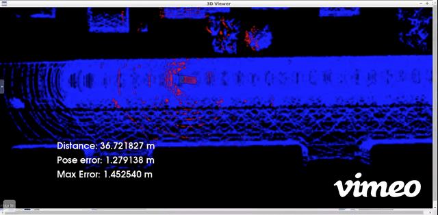
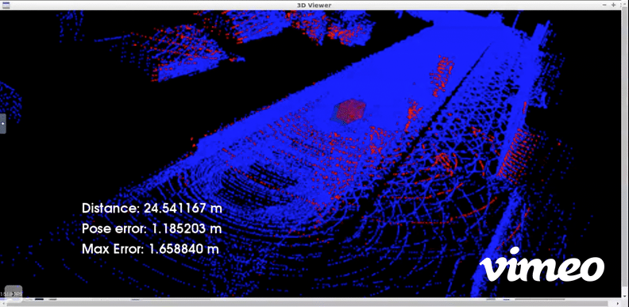

# Scan Matching Localization

This project localises a virtual moving Car (Actor) in Carla simulation environment.The Ego vehicle is continuously scanning the environment with a virtual lidar in Carla. ICP Scan Matching Algorithm from Point Cloud Library is used to align these lidar scans with the Point cloud map to estimate the Pose over time and Localise the car. This point cloud map of the scene has been extracted from the CARLA simulator.




Self-Driving Car Engineer Nanodegree<br/>
https://www.udacity.com/course/self-driving-car-engineer-nanodegree--nd013


# Installation

Since all the dependencies including PCL and Carla are preinstalled in Udacity worskspace Go to the Udacity workspace of the project "Scan Matching Localization" of the Lesson 3 "Localization" of the Self-Driving Car Engineer Nanodegree.

Copy the contents of the file [localisation/c3-main.cpp](code/c3-main.cpp) into the file `/home/workspace/c3-project/c3-main.cpp` in the Udacity workspace of the project "Scan Matching Localization". You can do it by copying and pasting the contents of the file (localisation/c3-main.cpp) .

# Usage

Start terminal. First Run the Carla simulator instance by using these commands:

```
su - student # Ignore Permission Denied, if you see student@ you are good
cd /home/workspace/c3-project
./run_carla.sh
```

Start another terminal. Compile & run the localisation project by using these commands:

```
cd /home/workspace/c3-project
cmake .
make
./cloud_loc

```


Once the project is running, click on the viewer and tap the UP key 3 times, with delays of 1 second between taps. If the green car gets left behind, run the project again and tap the UP key 3 times again. The second run or the third run usually produce better results than the results of the first run. **IMPORTANT: Never stop the Carla simulator.**


# Video Demonstrations

**Scan Matching Localization with LIDAR Point Clouds using Iterative Closest Point Algorithm**

https://youtu.be/khzQ2M7vSxU
1. The Red box in video is the Virtual Car Ground truth pose in the Carla simulation environment <br />
2. the Green box is the Estimated Pose of the car output by Localisation Algorithm.<br />
3. The Blue Point cloud map of the simulated environment was mapped for the Carla driving scene.<br />
4. The Lidar Scans in Red are provided at 20Hz by the virtual Lidar Sensor in Carla 
 

**The green box should coincide or overlap with the red ground truth with sufficient accuracy of within 2m in order to properly localise the car**

